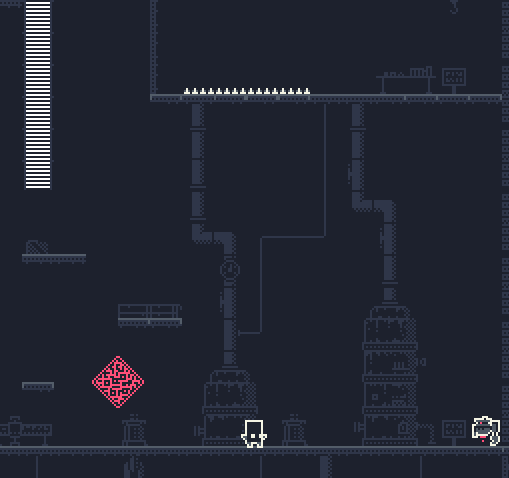

To showcase some of the features implemented on my [T2DEngine](../projects/t2dengine.html), I've developed a small DEMO for it.
It's simple but effective, displaying many of the Engine's most important features, such as: 
  - The powerful Sprite Animation system, used to construct and control Animation State Machines from sprite atlases.
  - The SID preprocessor tool, which parses the source code and replaces string constants with their correspondent hashed integer values.
    Using SID, we can program in terms of string constants knowing that, before building the game, these strings will be replaced by
    their hashed values, which can be compared in constant time and have a smaller memory footprint.
  - The integration with [Tiled Level Editor](https://www.mapeditor.org/), allowing the DEMO to load .tmx files and, not only render 
    the Tile Map, but also load data regarding collision geometry, "damage areas" (such as the spikes on the levels) and objects spawn
    positions.
  - The flexible Resource Management System, used to load sprite atlases and shader files.
  - The Memory Management System, based on [Pool Allocators](https://medium.com/@mateusgondimlima/designing-and-implementing-a-pool-allocator-data-structure-for-memory-management-in-games-c78ed0902b69).
  - The flexible Event System, that allow us to send custom messages between Game Objects.

* 	DEMO Gameplay*

#### DEMO Download

  - [32-bit Windows executable](https://github.com/mateusgondim/T2DEngine/releases/download/v1.0.0/T2D_DEMO_v1_0_0_WINDOWS.zip)
  
  You can also clone the GitHub project and build both the engine and the DEMO application manually. The instructions are on the project's [readme file](https://github.com/mateusgondim/T2DEngine).

  OBS. The MacOS version will be added shortly! but you already can, as mentioned above, build it manually.

#### Controls
  - Press Enter on the main menu to start the DEMO.
  - Use the arrow keys to move left, right, climb up and climb down.
  - A to Jump.
  - S to Attack.
  - P to Pause.
  - N to advance to the next level.

#### Source Code
  You can download the full source code [here](https://github.com/mateusgondim/T2DEngine/tree/master/game).

#### Status
 I consider this DEMO finished. But, i do intent on creating a more
 "complex" version of it, adding more enemies and
 interactions -- items, traps etc -- to the levels.

