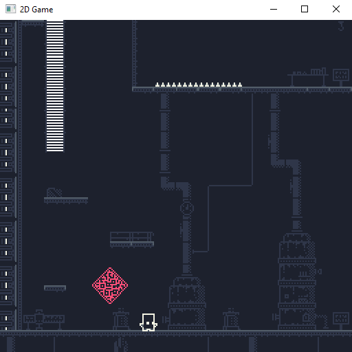
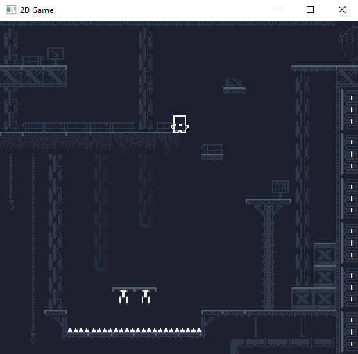

This project is a 2D platformer that i'm currently building using my [T2DEngine](../projects/t2dengine.html). It's being constructed alongside the engine, 
so it's dictating some of the engine's features. It's currently in a pre-alpha stage. You can download and play this version now (link below).
  
  
  * 	Pre-alpha screenshots*
#### Pre-alpha demo
  - [32-bit Windows executable](https://github.com/mateusgondim/T2DEngine/releases/download/v0.1.0-pre-alpha/game_WIN32.zip)
  - [Mac OS executable](https://github.com/mateusgondim/T2DEngine/releases/download/v0.1.0-pre-alpha/game_MacOS.zip)
  
  You can also clone the GitHub project, and build the engine and the game application manually, the instructions are on the project's [readme file](https://github.com/mateusgondim/T2DEngine).

#### Observation
   The MacOs executable is a Unix executable, so it needs to be run from the terminal.
   Just go the downloaded folder and type *./game*.

#### Controls
  - Use the arrow keys to move left, right, climb up and climb down.
  - A to Jump.
  - S to Attack.

#### Source Code
  You can download the full source code [here](https://github.com/mateusgondim/T2DEngine/tree/master/game).

#### Status
 In development (pre-alpha).

