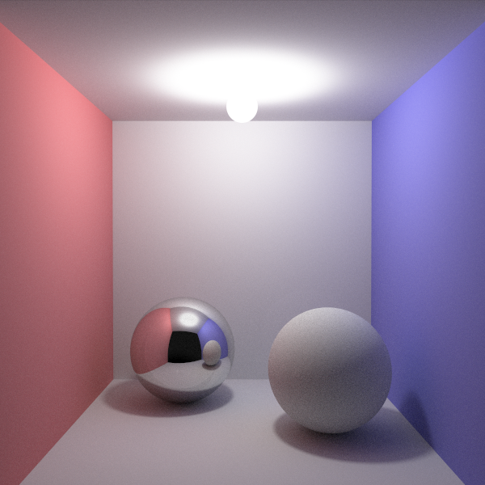

Since I've always been fascinated with Ray Tracing, i decided to finally dive deep into this subject.
I grabbed a few books (see the references section at the end) and started to learn everything
i could about Ray Tracing with the intent on finally writing my on.
The result was lux, a global illumination renderer that uses Monte Carlo path tracing to
generate physically based images.

			*A modified Cornell Box scene rendered with lux*

#### Key Features
  - Specular and Diffuse BRDFs.
  - Antialiasing via multisampling with stratified and random sampling techniques.
  - Ray-sphere and ray-triangle intersection.
  - 3D Math library.
  - Modified Cornell box scene description.
  - Global illumination via Monte Carlo path tracing.
  - Soft shadows from diffuse lights.

#### Status
  Even though lux is a working renderer, that are still some missing features that
  i really want to implement. I'll try to get them running on the near future.
  - Acceleration data structure for ray intersection tests.
  - Support for triangle meshes.
  - Support for multithreading.
  - More BRDFs.

#### Source Code
  You can download the full source code [here](https://github.com/mateusgondim/lux).

#### References
  - [Realistic Ray Tracing](https://www.amazon.com/Realistic-Tracing-Second-Peter-Shirley/dp/1568814615)
  - [Fundamentals of Computer Graphics](https://www.amazon.com/Fundamentals-Computer-Graphics-Peter-Shirley/dp/1568814690)
  - [Physically Based Rendering: From Theory To Implementation](http://www.pbr-book.org/)
  - [Ray Tracing in one weekend](https://raytracing.github.io/)
  - [Ray Tracing the next week](https://raytracing.github.io/)
  - [Ray Tracing the rest of your life](https://raytracing.github.io/)
