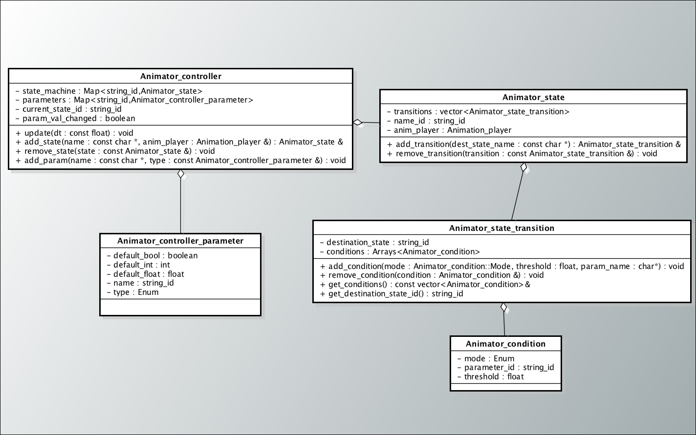

  T2DEngine is a tile based 2d game engine. The engine is being written in C++, using GLFW/OpenGL for rendering.
  You can find more information about the engine, including the project's readme file, [here](https://github.com/mateusgondim/T2DEngine).
  I'm also currently making a DEMO for it, you can check that project [here](../projects/2d_game.html).

  
			*T2DEngine's Animation System*

#### Key Features
  - A .tmx file parser, which loads tile maps constructed using the [Tiled](https://www.mapeditor.org/) tool.
  - Fully fledged sprite animation system.
  - Memory management  system with custom allocators.
  - Resource management system.
  - 2D sprite batching.
  - Sprite atlas loading system, using .xml data files.
 
#### Source Code
  You can download the full source code of T2DEngine [here](https://github.com/mateusgondim/T2DEngine/tree/master/engine/source).
#### Status
  In development
